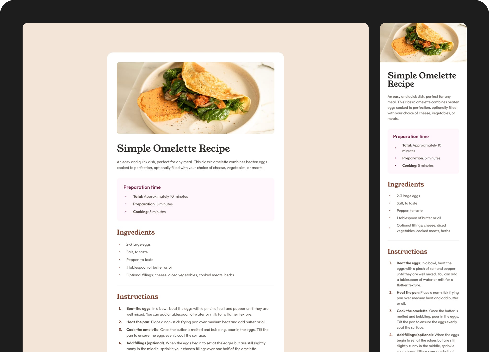

# Frontend Mentor - Recipe page solution

This is a solution to the [Recipe page challenge on Frontend Mentor](https://www.frontendmentor.io/challenges/recipe-page-KiTsR8QQKm). Frontend Mentor challenges help you improve your coding skills by building realistic projects. 

## Screenshot

## Link

- Solution URL: [Live Site](https://mateusdmc.github.io/fm-recipe-page/)

## My process

### Built with

- Semantic HTML5
- Flexbox
- Mobile-first
- [Tailwind CSS](https://tailwindcss.com/) - CSS framework